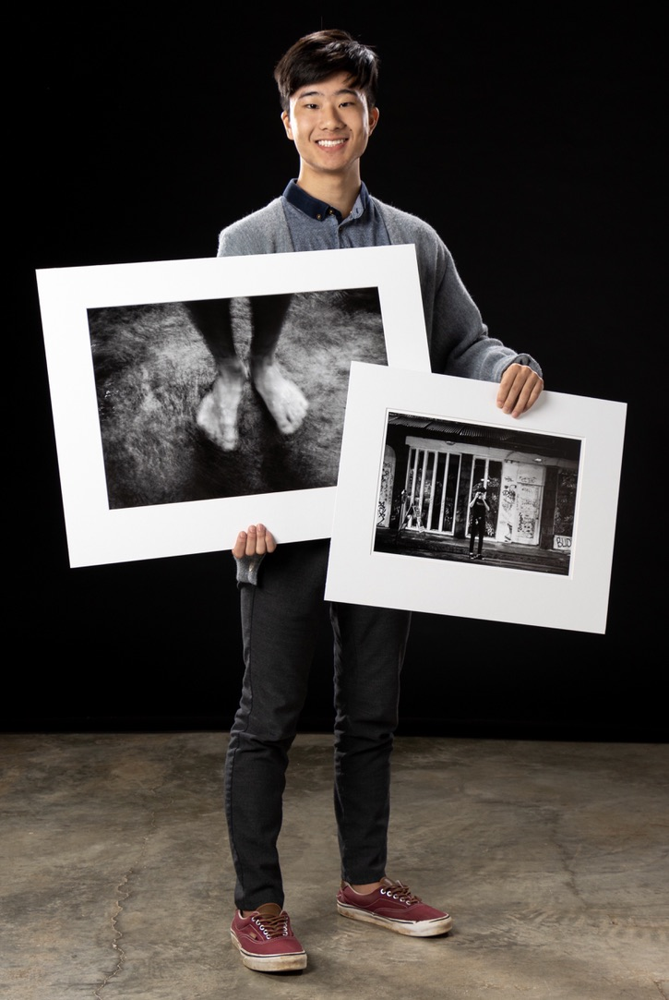

---
title: Skyler Sung
---
__Pronouns: he/him/his__

- __Occupation:__ Undergraduate Neuroscience student and microbiology research assistant at Amherst College
- __Research Interests:__ Microbiomes, fungal genomics, symbiosis, neuromodulation
- __Hobbies:__ Photography, Hiking, Travel
- __Links:__ 
  - [Photography Website](https://www.skylersung.com/)!

